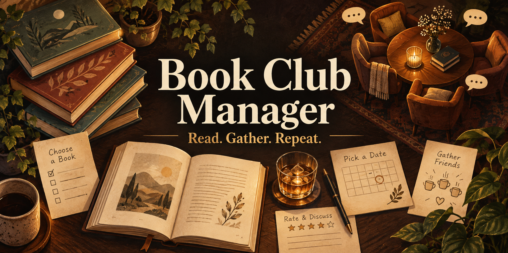

# Book Club Manager



**A home for the parts of book club that happen between book clubs.**

Collect suggestions, vote on books and dates, find a host, and remember what everyone thought afterward. Keep the reading history, the books that almost won, and the occasional wildly optimistic New Year's prediction in one place.

I built this for me and my book club. The public version keeps the system and design, with an entirely invented club to explore. Make it your own, and feel free to improve mine. Hopefully it gives you a useful starting point, or at least a few ideas.

Cheers!

Jess

> **Start here:** You can try the whole local demo without an account, a database subscription, or an AI key. Your edits stay on your computer. The first setup needs an internet connection; ordinary demo use works offline afterward.

## Try it on your computer

1. Install the **LTS** version of [Node.js](https://nodejs.org/). This is the small program that runs the app. Version 22 or newer is required.
2. [Download the project ZIP](https://github.com/jessecmaddox3/book-club-manager/releases/latest). Unzip it into a folder you want to keep.
3. Open **Start.command** on a Mac or **Start.cmd** on Windows. On Linux, run `sh start.sh` in that folder.
4. Wait for the first setup to finish. A browser window opens at **http://127.0.0.1:5055**. Choose an invented reader and click **Explore the club**.

Keep the terminal window open while using the app. Press **Control+C** in that window when you're done. Open the same Start file next time; your edits will still be there.

Mac won't open the file, or the browser didn't appear? The [beginner guide](docs/getting-started.md) walks through those steps. You do not need Git or a GitHub account.

### Prefer a terminal?

```sh
npm ci
npm run build
npm run demo
```

## What's inside

| Part | What you can do |
| --- | --- |
| Books and ballots | Suggest a book, prepare a shortlist, rate every candidate, mark dates, and volunteer to host or bring drinks. |
| Results | See book and date charts after voting. Organizers get the response matrix, ties, volunteers, and exemption-aware reminder list. |
| Reading history | Keep meetings, notes, book ratings, skipped books, attendance answers, past nominees, and books that nearly won. |
| Members | Browse readers and alumni, their past suggestions, hosted meetings, goals, and annual predictions. |
| Organizer tools | Manage members and notes in the app; build, open, close, and reopen ballots with reviewable command-line plans. |
| Club routines | Prepare six kinds of message draft and a calendar file. You review and send the messages yourself. |
| Preference predictor | Explore an additive model with member, genre, recommender, and self-nomination effects, chronological evaluation, and saved forecasts. |
| Optional AI | Search for books, suggest reads, or propose genre labels with your own configured provider. Manual entry and the demo need no paid service. |

The included **Lantern Reading Room** has invented people, books, meetings, ratings, goals, and predictions. It is a working example, not a renamed copy of my club's records.

## Make it yours

- **Explore and customize locally:** edit the readable [club.config.json](club.config.json), then restart. [Configuration guide](docs/configuration.md).
- **Run a real shared club:** use the separate [hosted installation guide](docs/hosting.md). It starts with an empty database and explicitly linked accounts. The account-free local demo is only for your own computer.
- **Run the monthly routine:** [organizer workflows](docs/operations.md), [example ballot](examples/ballot.json), and a portable [AI assistant skill](skills/book-club-operations/SKILL.md).
- **Keep your work:** [backup and restore](docs/backups.md).
- **Understand the design:** [architecture and limitations](docs/architecture.md), [privacy](docs/privacy.md), and [asset credits](docs/assets.md).

Annual goals and predictions are currently viewing/reporting features; there is no dedicated authoring screen. Preference forecasts use the CLI. This app prepares communication drafts but does not send email or add events to anyone else's calendar.

## Improve it

Bug reports, simpler setup, better accessibility, and useful features are welcome. See [CONTRIBUTING.md](CONTRIBUTING.md). Please use invented examples in issues and screenshots.

**MIT licensed:** use, change, share, sell, and build on the code. Keep the license notice. Included fonts keep their own open licenses. See [LICENSE](LICENSE).
